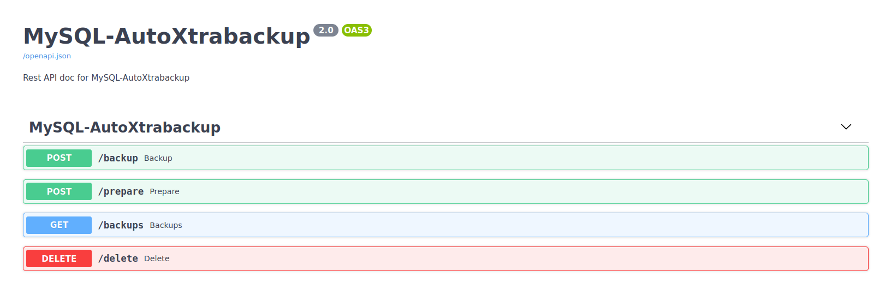

Here is the basic ideas how to use API calls to operate on backups
==================================================================

Currently, we have only 4 endpoints.

Sample cURLs:
-------------

After starting API server:

::

    $ sudo `which autoxtrabackup` --run-server

Of course you can use the Web UI for taking backups, but in case you want to send requests,
below I have provided sample cURLs.

Taking backup:

::

    $ curl -X POST http://127.0.0.1:5555/backup
    {"result":"Successfully finished the backup process"}

Preparing backup:

::

    $ curl -X POST http://127.0.0.1:5555/prepare
    {"result":"Successfully prepared all the backups"}

Listing backups:

::

    $ curl http://127.0.0.1:5555/backups
    {"backups":{"full":[{"2021-05-05_18-37-36":"Full-Prepared"}],"inc":["2021-05-05_18-38-19"]}}

Removing backups:

::

    $ curl -X DELETE http://127.0.0.1:5555/delete
    {"result":"There is no backups or backups removed successfully"}